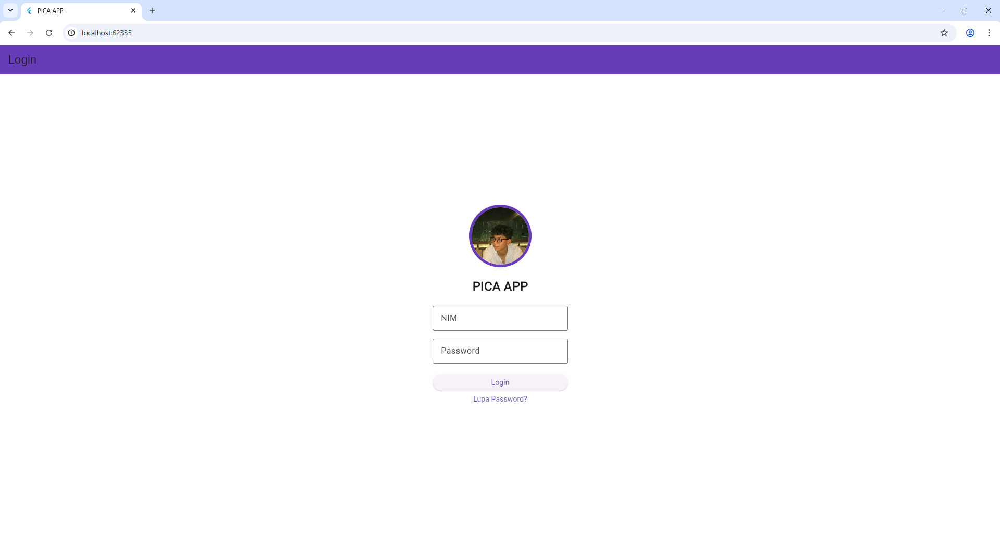
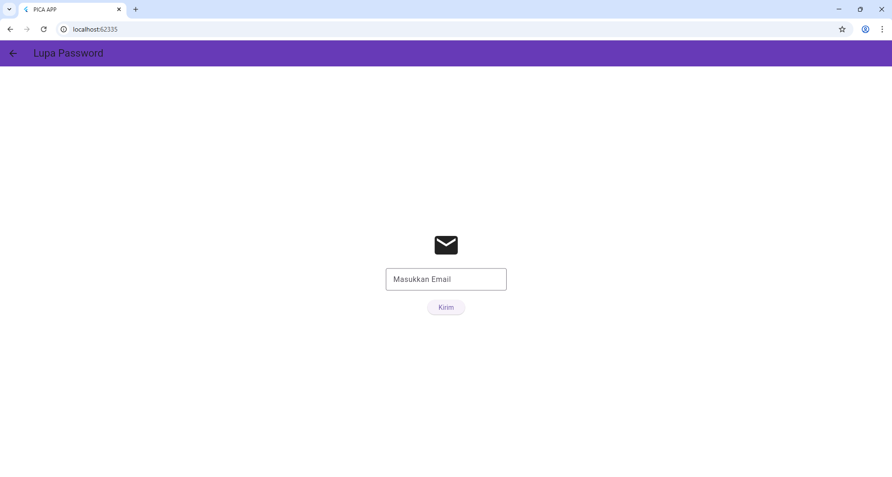
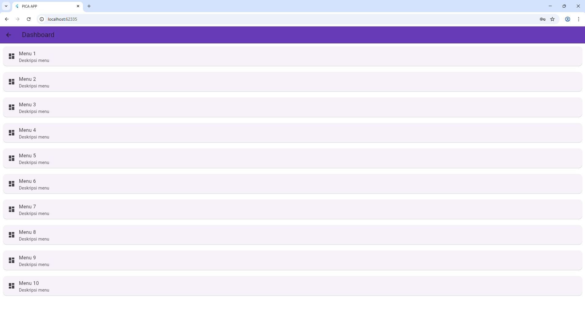

PICA APP adalah aplikasi mobile sederhana berbasis Flutter yang dibuat untuk memenuhi tugas praktikum.
Aplikasi ini memiliki fitur utama berupa Login menggunakan NIM, Lupa Password berbasis email, dan Dashboard.

Aplikasi ini juga menerapkan konsep dasar hingga menengah dalam Flutter seperti penggunaan widget, form validation, navigasi antar halaman, serta manajemen state sederhana menggunakan `setState()`.

Tujuan Pengembangan

* Menerapkan konsep dasar Flutter (Scaffold, AppBar, Widget)
* Menggunakan Form dan validasi input
* Mengimplementasikan navigasi antar halaman
* Membuat UI/UX sederhana namun rapi dan konsisten

 Fitur Aplikasi

* Login menggunakan **NIM dan Password**
* Lupa Password menggunakan **Email**
* Dashboard dengan daftar menu
* Loading indicator saat proses login
* Validasi input (tidak boleh kosong)
* Feedback user menggunakan SnackBar & AlertDialog

Akun Login
Gunakan akun berikut untuk login:

NIM      : 2401020057
Password : 123

Teknologi yang Digunakan

* Flutter
* Dart
* Material Design

Cara Menjalankan Aplikasi

1. Masuk ke folder project:
cd pica_app
2. Install dependencies:
flutter pub get
3. Jalankan aplikasi:
flutter run

Screenshot Aplikasi

